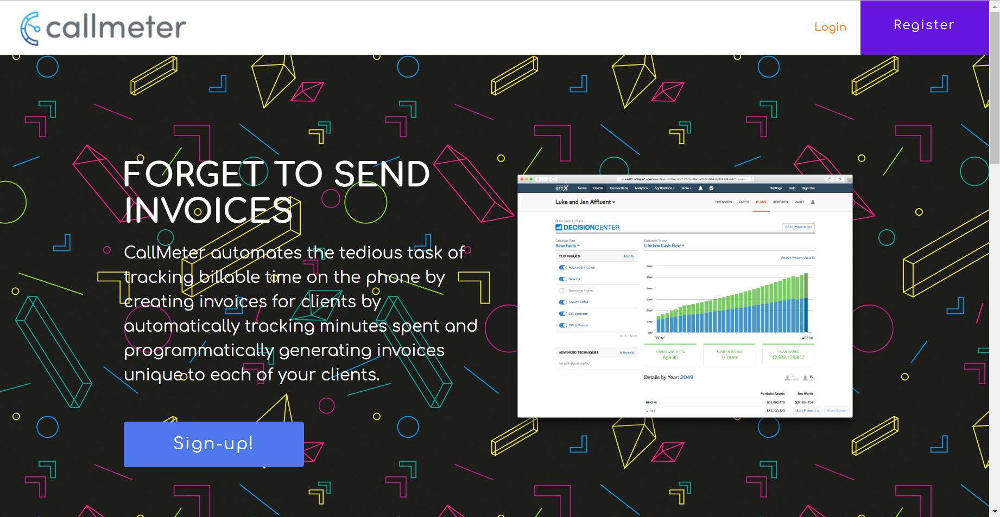
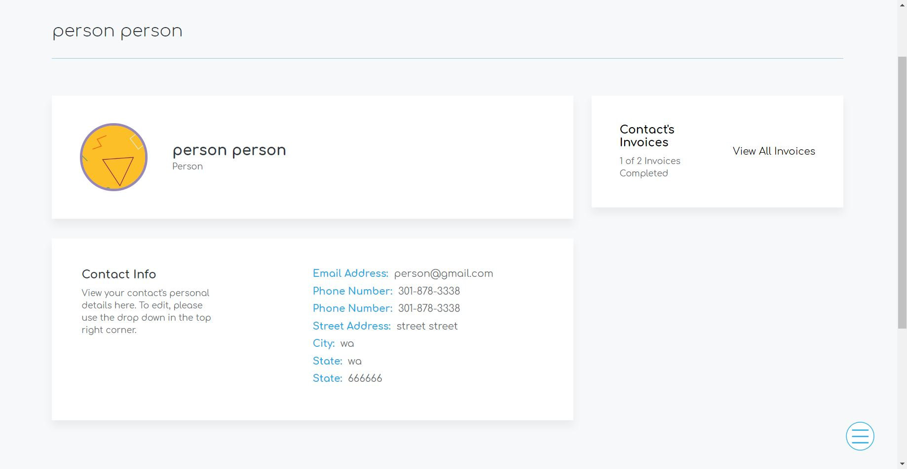
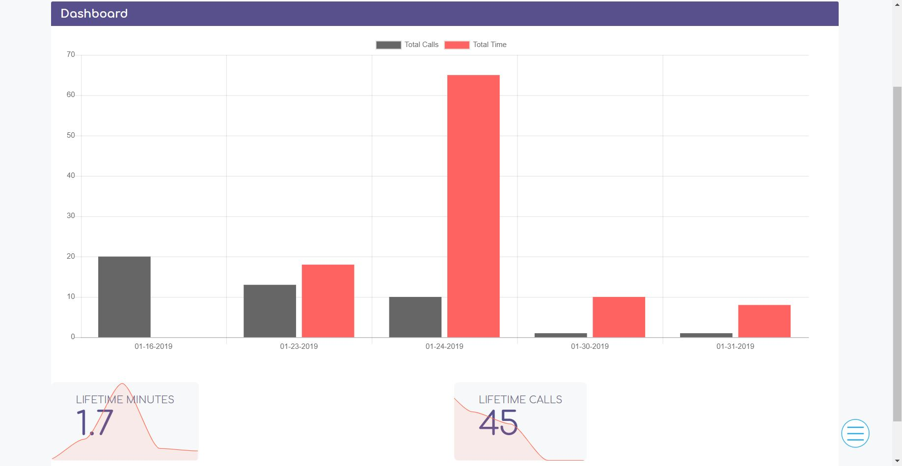

# CallMEter 
This project was bootstrapped with Create React App.

## Welcome to CallMEter 

CallMEter is a tool for business owners and freelancers that takes the admin work out of tracking and invoicing for billable time spent on calls. 
Check us out at <a href="https://callmeter.netlify.com/">callmeter.netlify.com</a>!
Try our demo account: 
org name: CallMeter Demo 
password: password123

### Features:
- CallMEter provides a phone number powered by twilio, allowing for call time tracking, that reroutes to your provided business number. 
- Client management, easily create, call, and edit clients from their profile. 
- In app inbound and outbound browser calling and call redirects to your phone while you're offline. 
- Automated invoicing system. CallMEter programmatically generates invoices unique to each client and delivers them via email with a single click. 
- Graphic breakdown of calls made over time and the time spent on each.

### Preview: 
Landing Page

Client Profile

Stats Dashboard

### Tech Stack:

React and Redux for state management on the frontend

MongoDb for backend data management -clients, users, calls

Twilio for call functionality

NodeMailer for invoice mailing

### Check out our api docs in <a href="https://gist.github.com/jsantiag/1c6ce266616343d228bd2279781b1f62">this public gist</a>
